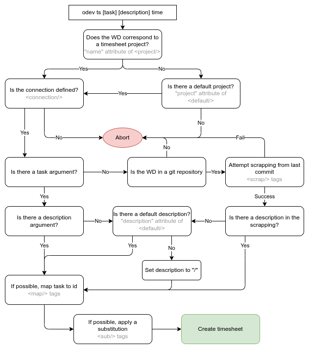

# Timesheet command

## Setup the configs

The timesheet command uses the `timesheets.xml` config file (located in the same folder as other odev config files) to
interpret your prompt. You'll have to edit this file to fit your needs, feel free to ping AZL for help. The file is
automatically validated when you run the command so you will be notified if you made any mistakes.

### Connections

Define the databases on which you want to make your timesheets in the the `connections` tag. Each `connection` needs to
have the `name` (for referencing this connection), `db` and `url` attributes defined.

#### Example:

```xml
<connections>
    <connection name="odoo" db="openerp" url="www.odoo.com" />
    ...
</connection>
```

### Projects

Define how to streamline your timesheet process on the projects you usually work on in the `projects` tag. Each
`project` needs a `name` and a `connection` attribute, and can contain a number of `map`, `sub` and `scrap` tags.

The `connection` attribute defines which connection to use for the project

The `name` is used to determine for which project you are attempting to make a timesheet for, using the current working
directory.

When running the command, the first matching project will be used, therefore you can define an order of priority by
ordering the project tags.

The `map` tag defines a mappng between the task argument (`from`) to a task id in the database (`to`).

The `sub` tag is used to apply a regex substitution of the description argument.

The `scrap` tag is used to scrap the task and (optionally) the description arguments from the last commit. If the regex
`pattern` is matched then the task and description arguments are set to the matching groups defined in the `task` and
`description` attributes.

#### Example:

```xml
<projects>
    <project name="eggo" connection="odoo">
        <map from="10" to="420420" />
        <sub pattern="(\d+)" repl="[TASK \1]" />
        <scrap pattern="\[(SPRINT )?([\w\s]+)\]\s*\[(TASK )?(\d+)\]" task="2" description="4" />
        ...
    </project>
</projects>
```

Let's say I have worked an hour on task number 6969, which is part of sprint 10 of my eggo project and I have to
timesheet on a sprint-specific task on odoo.com. I can execute the following command while in my `~/src/eggo` directory.

```
odev ts 10 6969 1
```

It will create a timesheet on the sprint 10 task which has id = 420420 on odoo.com with a description "\[TASK 6969\]"

Alternatively, if I just made a commit called "\[SPRINT 10\]\[TASK 6969\] Nice dev", I can execute the following for the
same result.

```
odev ts 1
```

### Shortcuts

Shortcuts can also be defined for non project-specific tasks. Just add `shortcut` tags inside `shortcuts` with
attributes `name`, `connection`, `mode`, `id`, and (optionally) `description`.

The `mode` can be either "task" or "project" depending on which model you'd like to timesheet on.

Example:

```xml
<shortcuts>
    <shortcut name="misc" connection="odoo" mode="task" id="2210840" description="/" />
    <shortcut name="meeting" connection="odoo" mode="project" id="826" />
    ...
</shortcuts>
```

If I'd like to timesheet 15 mins with description "/" on the misc task (id = 2210840 on odoo.com):

```
odev ts -s misc 0.25
```

If I'd like to timesheet 30 mins with description "Meeting w/ avs" on the meeting project (id = 826 on odoo.com):

```
odev ts -s meeting "Meeting w/ avs" 0.5
```

### Default

The `default` tag can be used to set a default project and/or a default description.

```xml
<default project="eggo" description="[DEV]" />
```

## Using a project

Below is a diagram showing the logic flow of the timesheet command when using a project, which is the default behavior.



## Using a shortcut

Below is a diagram showing the logic flow of the timesheet command when using a shortcut. To use this flow add the `-s`
or `--shortcut` argument to your command line.


