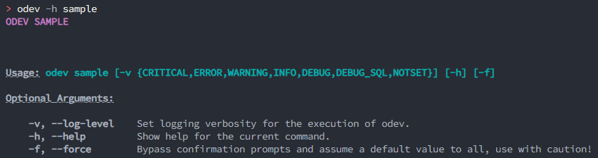
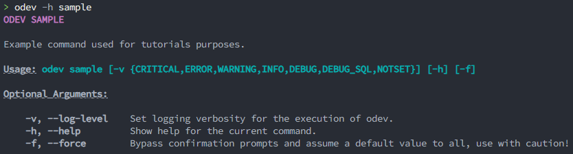
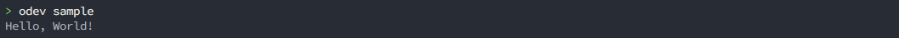
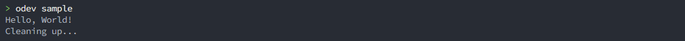
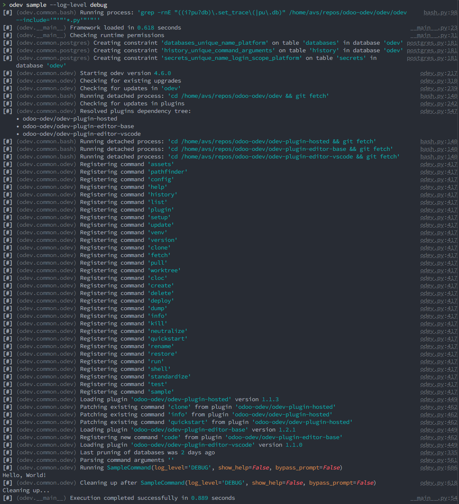
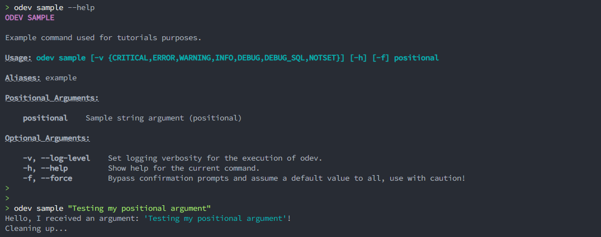
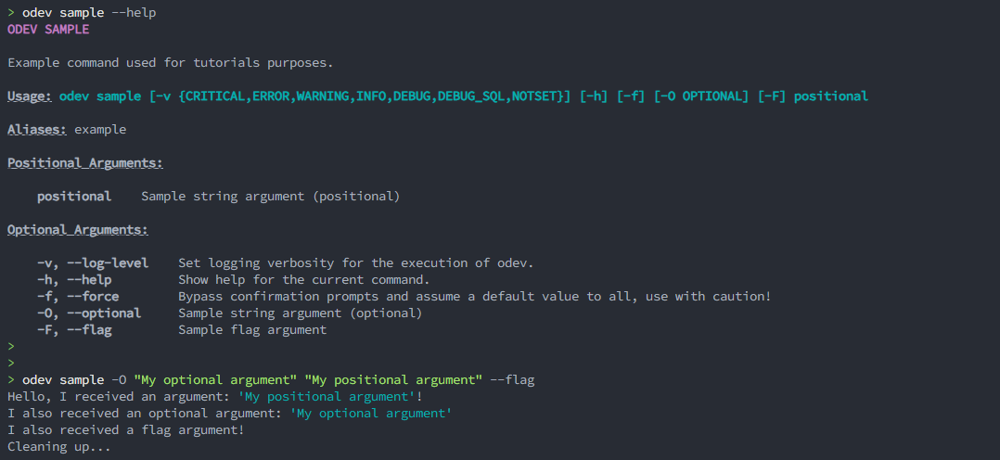
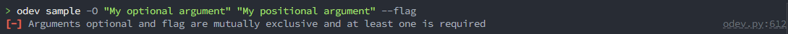
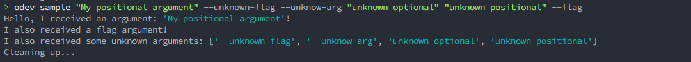

# Commands

Commands define features that will be rendered available to end users, allowing them to tell Odev to perform actions
based on flags and arguments passed through the command line interface (CLI).

In this basic tutorial, we'll see how we can define a brand new command to print message to the terminal.

## Table of contents

-   [Commands](#commands)
    -   [Table of contents](#table-of-contents)
    -   [Adding a new command](#adding-a-new-command)
        -   [Implementing features](#implementing-features)
        -   [Cleaning up](#cleaning-up)
        -   [Command arguments](#command-arguments)
            -   [Positional arguments](#positional-arguments)
            -   [Optional arguments](#optional-arguments)
    -   [Going further...](#going-further)
        -   [Extended command classes](#extended-command-classes)
        -   [Mutually exclusive arguments](#mutually-exclusive-arguments)
        -   [Unknown arguments](#unknown-arguments)
        -   [Raising errors](#raising-errors)

## Adding a new command

To define a new command, you'll have to create class inside the [odev/commands](../../odev/commands/) directory.

At the bare minimum, you'll have to extend the base `Command` class from
[odev/common/commands/base.py](../../odev/common/commands/base.py) and define a `_name` and a `run()` method in your new
class.

Create a new file `odev/commands/sample.py`, import the base `Command` class and give it a name. Don't forget to add a
simple `run()` method. The name you chose should be unique across all commands, so be sure to choose one that does not
conflict with another command.

```python
from odev.common.commands import Command


class SampleCommand(Command):
    _name = "sample"

    def run(self):
        ...

```

This will result in a new command `odev sample` which for the moment does nothing, but can already be shown in the help
provided by Odev. Open your terminal and run `odev sample --help` to see it appear with default arguments.



> [!TIP]
>
> Sometimes you'll want to provide aliases for your command, such as in the existing commands `delete` (to delete an
> existing database) which has an alias to `rm`. This lets your users use the same command with a shorter name, which
> some will appreciate.
>
> Declare command aliases by adding the `_aliases` property to your class:
>
> ```python
> class SampleCommand(Command):
>    _name = "sample"
>    _aliases = ["example"]
> ```
>
> You command can now be called with either `odev sample` or `odev example`.

Add a description to the command by adding a docstring to the class:

```python
from odev.common.commands import Command


class SampleCommand(Command):
    """Example command used for tutorials purposes."""

    _name = "sample"

    def run(self):
        ...

```

Re-run `odev sample --help` to see the description appear in the previous screen.



### Implementing features

For now, our sample command does nothing. It's about time we let it do something! Making our command execute an action
is as easy as adding code to our `run()` method. This method will be called by the framework whenever our command is
invoked.

```python
from odev.common.commands import Command


class SampleCommand(Command):
    """Example command used for tutorials purposes."""

    _name = "sample"

    def run(self):
        self.console.print("Hello, World!")

```

Run `odev sample` in your terminal to see it come to life:



That's it! Let your imagination run free!

### Cleaning up

Sometimes, you will want to clean some things up after running your command, like for example removing temporary files.
While this is possible to implement those cleanup actions directly in the `run()` method, it would require you to handle
errors and crashes manually. To avoid resorting to this, another method `cleanup()` can be extended. It will be run
after your command regardless of whether it succeeded or resulted in an error.

> [!IMPORTANT]
>
> Contrary to `run()`, `cleanup()` is not an abstract method that needs to be reimplemented at all times, so don't
> forget to call its parent if you override it.

```python
from odev.common.commands import Command


class SampleCommand(Command):
    """Example command used for tutorials purposes."""

    _name = "sample"

    def run(self):
        self.console.print("Hello, World!")

    def cleanup(self):
        super().cleanup()
        self.console.print("Cleaning up...")

```



### Command arguments

What would a command be without arguments? Most of the time you'll want to perform different actions based on user
input. While you could very well be asking questions to the end user whenever the command is run, it is likely you want
to allow them to provide different values before your command is even called. Command arguments let you do that by
defining flags or attributes and validating the user input.

As we've already seen in [Adding a new command](#adding-a-new-command), some arguments are pre-defined for you. They
come from the base `Command` class we've inherited from. Those are used by other parts of odev, try them with your own
command or any existing one:



To add your own arguments, import [odev.common.args](../../odev/common/arguments.py) and define new class attributes for
each argument you want to add. Check [odev/common/arguments.py](../../odev/common/arguments.py) to see what types of
arguments are available.

After defining your arguments, they will be made available in your methods under `self.args`.

Arguments are divided into two classes: **positional** and **optional** arguments.

#### Positional arguments

Positional arguments are, as the name implies, detected according to their position in the command entered by the user.
In other words, the order in which they are entered matters, and that order is the one in which you will define the
arguments in your command. Usually, you'll want to keep as few as possible to keep the command as clean as possible in
the CLI and avoid the user mixing inputs.

To define a positional arguments, use any argument class except for `args.Flag` and set it up **without** an alias.

Let's add a positional argument named `positional`, expecting any string value. We'll modify the `run()` method to echo
its value to the terminal.

```python
from odev.common  import args
from odev.common.commands import Command


class SampleCommand(Command):
    """Example command used for tutorials purposes."""

    _name = "sample"
    _aliases = ["example"]

    positional = args.String(description="Sample string argument (positional)")

    def run(self):
        self.console.print(f"Hello, I received an argument: '{self.args.positional}'!")

    def cleanup(self):
        super().cleanup()
        self.console.print("Cleaning up...")

```

The argument is picked up by the help command and can be used directly inside my class:



#### Optional arguments

Optional arguments are arguments which place does not matter in the command. To be correctly identified they therefore
need a key, commonly referred to as an **option**. Those options are identified by a double-dashed keyword (`--key`) or
a single-dashed letter (`-k`) and can or can not be followed by a value. Optional arguments not expecting a value are
often referred to as **flags** and serve as booleans to enable or disable features during the runtime of the command.
Optional arguments expecting a value are used to organize the command in the CLI and make it less confusing to write and
read.

Define a flag by using `args.Flag`, or a keyword argument by using any other argument class. In both cases, you'll need
to provide at least one alias to the argument to make it optional.

> [!IMPORTANT]
>
> While nothing technically prevents adding an alias that does not start with dashed, it is important to follow the
> conventions so that the CLI does not become confusing to users.
>
> Keywords consist of a double-dash followed by one or more dash-separated words (i.e. `--keyword` or
> `--keyword-argument`). Shortcuts or single-letter arguments will start with a single dash and contain only one letter
> (i.e. `-k`).

> [!TIP]
>
> Arguments aliases are case-sensitive: `-k` and `-K` can be used in different arguments and will not clash together.



## Going further...

### Extended command classes

A variety of Command classes already exist with predefined arguments and behaviors. Check
[odev.common.commands](../../odev/common/commands/) to see the available classes and learn about their features.

### Mutually exclusive arguments

Sometimes you'd want arguments to be mutually exclusive, meaning can two or more arguments cannot be used at the same
time. You can exclude combinations of arguments to be passed together by adding them to the `_exclusive_arguments`
attribute of your class.

> [!NOTE]
>
> This will also make at least one of those arguments mandatory.

```python
class SampleCommand(Command):
    """Example command used for tutorials purposes."""

    _name = "sample"
    _aliases = ["example"]

    _exclusive_arguments = [("optional", "flag")]

    positional = args.String(description="Sample string argument (positional)")
    optional = args.String(aliases=["--optional", "-O"], description="Sample string argument (optional)")
    flag = args.Flag(aliases=["--flag", "-F"], description="Sample flag argument")

    ...
```



### Unknown arguments

By default, Odev will treat any unknown argument received as invalid and raise an error.

For some commands, you might want to receive additional arguments without parsing them. This is the case for commands
calling system commands under the hood, like `odoo-bin` to run a database. To avoid both errors on unknown arguments and
store them, use the `_unknown_arguments_dest` attribute in your command class.

```python
class SampleCommand(Command):
    """Example command used for tutorials purposes."""

    _name = "sample"
    _aliases = ["example"]

    _unknown_arguments_dest = "additional_args"

    positional = args.String(description="Sample string argument (positional)")
    optional = args.String(aliases=["--optional", "-O"], description="Sample string argument (optional)")
    flag = args.Flag(aliases=["--flag", "-F"], description="Sample flag argument")

    def run(self):
        self.console.print(f"Hello, I received an argument: '{self.args.positional}'!")

        if self.args.optional:
            self.console.print(f"I also received an optional argument: '{self.args.optional}'")

        if self.args.flag:
            self.console.print("I also received a flag argument!")

        if self.args.additional_args:
            self.console.print(f"I also received some unknown arguments: {self.args.additional_args}")
```



### Raising errors

Your code may sometimes encounter issues and this may be due to incorrect user input. To gracefully handled expected
errors and let Odev know the context around those errors, use the built-in `self.error("message")` method. This will
create an Exception that you can then raise and that Odev will catch, gracefully displaying the error message to the
user.

However, when the error is not induced by the user it is often preferable to let other exceptions go through and remain
uncaught. This allows for tracebacks to be displayed, which are useful when debugging or to detect issues due to the
code itself.
