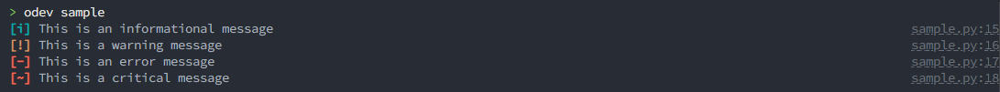
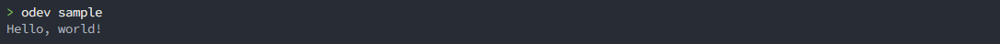
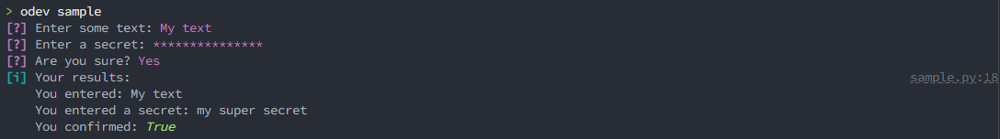
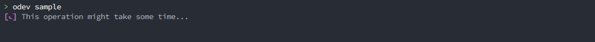
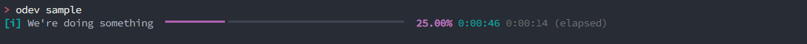

# Common Modules

The python modules stored under the [odev/common/](../../odev/common/) directory are a collection of helpers that can be
reused throughout Odev.

## Table of contents

-   [Common Modules](#common-modules)
    -   [Table of contents](#table-of-contents)
    -   [Commands](#commands)
        -   [Base `Command`](#base-command)
        -   [Database Commands](#database-commands)
            -   [`DatabaseCommand`](#databasecommand)
            -   [`LocalDatabaseCommand`](#localdatabasecommand)
            -   [`RemoteDatabaseCommand`](#remotedatabasecommand)
            -   [`DatabaseOrRepositoryCommand`](#databaseorrepositorycommand)
            -   [`OdoobinCommand`](#odoobincommand)
            -   [`OdoobinShellCommand`](#odoobinshellcommand)
            -   [`OdoobinShellScriptCommand`](#odoobinshellscriptcommand)
        -   [Other commands](#other-commands)
            -   [`GitCommand`](#gitcommand)
    -   [Connectors](#connectors)
        -   [`GitConnector`](#gitconnector)
        -   [`PostgresConnector`](#postgresconnector)
        -   [`RestConnector`](#restconnector)
        -   [`RpcConnector`](#rpcconnector)
    -   [Databases](#databases)
    -   [User Interactions](#user-interactions)
        -   [Printing messages](#printing-messages)
        -   [Requesting user input](#requesting-user-input)
        -   [Displaying live progress](#displaying-live-progress)
            -   [Progress spinner](#progress-spinner)
            -   [Progress bar](#progress-bar)

## Commands

Odev is made to run commands, and sometimes those commands share features. Under
[odev/common/commands/](../../odev/common/commands/) you will find a collection of abstract command classes which can be
inherited from and which will serve as boilerplate for predetermined features and actions.

### Base `Command`

The simplest form of a command, includes what is necessary so that the framework can load and run it.

### Database Commands

Commands that are used to interact with a database. See [Databases](#databases) to learn more about databases.

#### `DatabaseCommand`

Base class for managing a database from within Odev. Use this class when not sure what type of database you'll be
working on.

#### `LocalDatabaseCommand`

Works exclusively with PostgreSQL databases that can be queried on the local system. Includes a connector to the
PostgreSQl database itself and allows for SQL queries.

#### `RemoteDatabaseCommand`

Works with databases that are running and reachable through the network. Typically, adds a connector for JSON-RPC and
allows querying the database remotely with a set of credentials that will be asked to the user.

#### `DatabaseOrRepositoryCommand`

Same as [`DatabaseCommand`](#databasecommand) but allows for specifying a repository URL instead of a database name.

#### `OdoobinCommand`

Will work with a local database that is also an Odoo database. Allows for spawning `odoo-bin` processes or interacting
with them.

#### `OdoobinShellCommand`

Overload of `OdoobinCommand` to spawn and interact with `odoo-bin shell`.

#### `OdoobinShellScriptCommand`

Same as `OdoobinShellCommand` but used to inject a script into the shell then exit.

### Other commands

Various commands are merely helpers for arguments, there are not classified in the above categories for the sake of
simplicity.

#### `GitCommand`

Commands inheriting from this one will work with a repository (cloned locally or not).

## Connectors

Connectors are classes used to query external system, whatever they could be.

### `GitConnector`

Play around with git repositories, either cloned locally or not.

### `PostgresConnector`

Query local PostgreSQL databases, create or drop databases, etc.

### `RestConnector`

Wrapper around `requests` and similar features, allow querying services over HTTP.

### `RpcConnector`

Query remote Odoo databases through JSON-RPC, with wrappers around models and ORM features.

## Databases

Databases are an important part of Odev, as most operations and commands revolve around those. A database could be local
or remote, which respectively mean they are a PostgreSQL database stored on the computer of the user or any Odoo
database or service accessible over the internet.

## User Interactions

Sometimes, your command will require interacting with the end user by the mean of printing messages or requesting input.

### Printing messages

Most of the time you'll use the logger of odev to print message to the console. They will be automatically formatted as
to indicate the criticality of the message and attract the user's attention in case something important happened. Logs
will automatically be omitted if the current log level (as passed through `--log-level`) is higher than the logging
instruction used.

```python
from odev.common.commands import Command
from odev.common.logging import logging


logger = logging.getLogger(__name__)


class SampleCommand(Command):
    """Example command used for tutorials purposes."""

    _name = "sample"

    def run(self):
        logger.debug("This helps me debug my code")
        logger.info("This is an informational message")
        logger.warning("This is a warning message")
        logger.error("This is an error message")
        logger.critical("This is a critical message")

```



You may sometimes want to print text to the console without a log level or with a custom format, in which case you can
use the `print()` method on the command class itself.

```python
from odev.common.commands import Command
from odev.common.logging import logging


logger = logging.getLogger(__name__)


class SampleCommand(Command):
    """Example command used for tutorials purposes."""

    _name = "sample"

    def run(self):
        self.print("Hello, world!")

```



### Requesting user input

You can interact with the user through the `console` object to request input with validation.

That object allows for different operations, depending on what type of data you want to collect, and will provide
autocompletion features when possible.

```python
from odev.common.commands import Command
from odev.common.logging import logging


logger = logging.getLogger(__name__)


class SampleCommand(Command):
    """Example command used for tutorials purposes."""

    _name = "sample"

    def run(self):
        text = self.console.text("Enter some text:")
        secret = self.console.secret("Enter a secret:")
        confirm = self.console.confirm("Are you sure?")

        logger.info(
            f"""Your results:
            You entered: {text}
            You entered a secret: {secret}
            You confirmed: {confirm}
            """
        )
```



A number of other input types exists, including selection within a list, multiple choices checkboxes, autocompleted file
paths, numbers with lower and upper bounds or fuzzy search amongst a list of entries. Check
[`console.py`](../../odev/common/console.py) to learn more about those.

### Displaying live progress

When an operation takes time to complete, it may be good to let the user know we are working on it. Odev provides two
main means of achieving this.

#### Progress spinner

The helpers in [`progress.py`](../../odev/common/progress.py) include a moving spinner that can be used as a context
manager to surround time-expensive tasks that cannot be accurately measured.

```python
from odev.common.commands import Command
from odev.common import progress

from time import sleep


class SampleCommand(Command):
    """Example command used for tutorials purposes."""

    _name = "sample"

    def run(self):
        with progress.spinner("This operation might take some time..."):
            sleep(60)

        self.print("Done!")

```



The spinner itself will disappear once the code in the `with` block has been completely executed.

#### Progress bar

Some other times, you might want to accurately measure the time spent and remaining when executing a task. This can be
the case, for example, while downloading a file over the network. This situation requires the use of progress bars,
which can be spawn as follows:

```python
from odev.common.commands import Command
from odev.common import progress

from time import sleep


class SampleCommand(Command):
    """Example command used for tutorials purposes."""

    _name = "sample"

    def run(self):
        progress_bar = progress.Progress()
        progress_task = progress_bar.add_task("We're doing something", total=60)
        elapsed_time = 0

        progress_bar.start()

        while elapsed_time < 60:
            progress_bar.advance(progress_task, 1)
            elapsed_time += 1
            sleep(1)

        progress_bar.stop()

        self.print("Done!")

```


